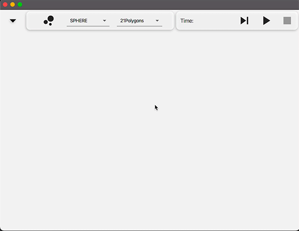
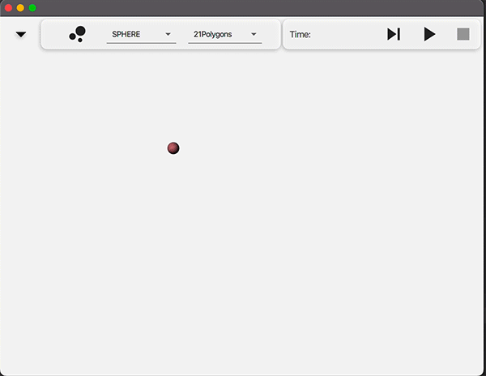

# Actor Positioning

- N-Body simulation [link](https://en.wikipedia.org/wiki/N-body_simulation) using distributed computation with actors.
- Each particle is indipendent and governed by a single actor
- Comunication between particles executed using message passing
- 3D/2D vision

## Simulation

## Features

## Settings

